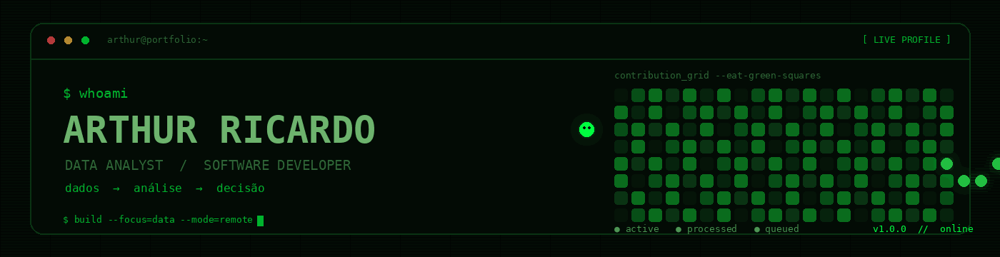

<div align="center"> 


<a href="https://github.com/Tp1Arthur"></a>
<a href="https://www.linkedin.com/in/arthur-ricardo-silva"></a>
<a href="mailto:arthur.r.silva@gmail.com"></a>


<code>dados → análise → decisão</code>

</div>

---

## <a name="sobre"></a><code>01 / sobre_mim.sh</code>

<div align="center">

> **Analista de dados em formação, desenvolvedor por prática e orientado a resultados.**

</div>

Sou estudante de **Análise e Desenvolvimento de Sistemas no IFRO**, com foco em **Análise de Dados**, Business Intelligence e desenvolvimento de soluções práticas.

Transformo dados brutos em informação útil por meio de dashboards, consultas, planilhas estruturadas e automações. Uso a **IA como ferramenta de produtividade**, mantendo o entendimento técnico e o raciocínio analítico no centro de cada entrega.

Meu objetivo é atuar internacionalmente, em equipes remotas, conectando análise, tecnologia e comunicação para apoiar decisões melhores.

```
┌─────────────────────────────────────────────────────────┐
│ $ cat perfil.txt                                        │
├─────────────────────────────────────────────────────────┤
│ FORMAÇÃO        ADS @ IFRO · Rondônia                   │
│ FOCO            Análise de Dados                        │
│                 Business Intelligence                   │
│                 Desenvolvimento de Software            │
│ OBJETIVO        Carreira internacional                  │
│                 Trabalho remoto                         │
│ DISPONIBILIDADE Remoto                                  │
└─────────────────────────────────────────────────────────┘
```

## <a name="stack"></a><code>02 / stack_de_dados --list</code>

### Ferramentas principais

<div align="center"> 


 </div>

### Nível atual

```
EXCEL        ████████████████████  avançado
GIT/GITHUB   ████████████████░░░░  confiante
C# / .NET    ██████████████░░░░░░  intermediário
POWER BI     ████████████░░░░░░░░  em evolução
SQL          ██████████░░░░░░░░░░  em evolução
```

## <a name="projetos"></a><code>03 / ls projetos/ --featured</code>

### Projetos selecionados

<details open>
<summary><b>Dados, análise e modelagem</b></summary>   


#### [Análise de Inflação — IPCA](https://github.com/Tp1Arthur/analise-inflacao-br)

Análise da inflação brasileira em **R**, com separação entre dados brutos, dados processados e scripts. Projeto principal do portfólio em análise de dados.

`R` `RStudio` `Estatística`

---

#### [TP1 Invest](https://github.com/Tp1Arthur/simulador-fiis-excel)

Simulador de investimento mensal em FIIs, com diferentes perfis de risco e cálculos de rendimento e dividendos desenvolvidos no Excel.

`Excel` `Modelagem financeira`

---

#### [MonBag App](https://github.com/Tp1Arthur/projeto_monbag_excel)

Planilha para organização de dados da declaração de Imposto de Renda, com validações, navegação entre abas e foco em usabilidade.

`Excel` `Validação de dados`

---

#### [Cases de Análise de Dados](https://github.com/Tp1Arthur/analise-de-dados-cases)

Coleção de estudos de caso para praticar análise de dados em diferentes contextos e manter uma rotina contínua de aprendizado.

`Excel` `SQL` `Lógica de dados`

</details> <details>
<summary><b>IA, desenvolvimento e universidade</b></summary>   


#### [GitHub Roadmap](https://github.com/Tp1Arthur/github-roadmap)

Roadmap pessoal para organizar estudos, tecnologias e evolução no desenvolvimento de software.

`GitHub` `Markdown`

---

#### [Engenharia de Prompts com NotebookLM](https://github.com/Tp1Arthur/notebooklm-engenharia-de-prompts)

Técnicas e experimentos de engenharia de prompts usando IA generativa como apoio para estudo e pesquisa.

`IA` `Prompt Engineering`

---

#### [Case Lanches Dubaum](https://github.com/Tp1Arthur/lanches-dubaum-case-study)

Estudo de caso acadêmico sobre análise de negócio e dados, desenvolvido durante a graduação em ADS.

`Análise de dados`

---

#### [Sistema de Gestão Hoteleira](https://github.com/Tp1Arthur/Projeto_Hotel_Paacas_Novos)

Levantamento de requisitos para um sistema de gestão hoteleira, com mais de 170 requisitos funcionais em 15 domínios.

`Engenharia de Requisitos`

</details>

## Certificações

<div align="center"> <a href="https://verify.skilljar.com/c/5os7ccd92msk">

</a>


<sub>DIO / Santander · Anthropic · 2026</sub>

</div>

## <a name="aprendizado"></a><code>04 / pipeline_de_aprendizado.log</code>

```
[■■■■■■■■■■■■■■■■■■■■]  camada atual

EXCEL        Tabelas dinâmicas · Power Query · PROCV/PROCX
SQL          Consultas · joins · agregações
POWER BI     Modelagem · DAX · dashboards
ESTATÍSTICA  Fundamentos aplicados a dados

[□□□□□□□□□□□□□□□]  próxima camada

PYTHON       Python para análise de dados
PANDAS       Manipulação e limpeza de dados
INGLÊS       Fluência para atuação internacional
IA APLICADA  Produtividade e automação em dados
```

## Princípios de trabalho

> **Aprender fazendo. Documentar o processo. Evoluir em camadas.**

- Priorizo projetos práticos em vez de teoria isolada.

- Documento decisões e aprendizados no GitHub.

- Uso IA para acelerar tarefas, sem terceirizar o entendimento.

- Consolido uma ferramenta antes de adicionar a próxima.

## <a name="estatisticas"></a><code>05 / github_stats --render</code>


<code>contribution_grid --eat-green-squares</code>

</div>

## <a name="contato"></a><code>06 / contato --show</code>

<div align="center">

**Aberto a oportunidades remotas em Análise de Dados, Business Intelligence e desenvolvimento.**

<a href="https://www.linkedin.com/in/arthur-ricardo-silva"></a>
<a href="mailto:arthur.r.silva@gmail.com"></a>


<sub><code>status: disponível para novos desafios</code></sub>

</div>
<div align="center">

</div>
